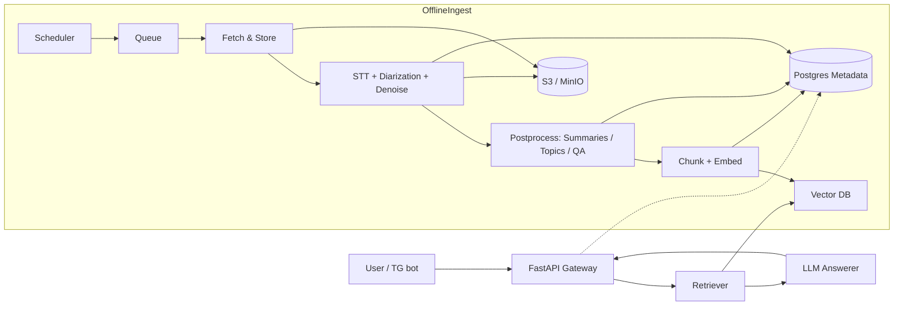

# STT_RAG_HSE_1Y_MAG
# Audio2RAG (DS Navigator)

## Состав веселых людей

* Ковынев Сергей Сергеевич	
* Чернов Петр Болеславович	
* Наумов Герман Константинович	
* Мороз Николай Сергеевич	

## Творческий руководитель 
Петр Гринберг

## А так же
ChatGPT & Claude 

## General Idea
> **Коротко:** офлайн‑инжест лекций/докладов (YouTube, конференции, подкасты) → качественная транскрибация с диаризацией и шумоподавлением → умная пост‑обработка (суммаризация, топики, ключи, Q&A) → разметка по таймкодам → индексирование в векторной БД → **RAG‑поиск** с ответами LLM + **кликабельные ссылки на источники и таймкоды** в ответах.
>
> **Ценность:** не «ещё один сервис транскрибации», а **навигатор знаний по DS‑домену** с доказательными ответами и маршрутизацией к первоисточнику.

---

## Содержание

* [Идея и ценность](#идея-и-ценность)
* [Ключевые сценарии пользователя](#ключевые-сценарии-пользователя)
* [Фичи](#фичи)
* [Архитектура](#архитектура)
* [Пайплайн обработки данных](#пайплайн-обработки-данных)
* [Модели и стек](#модели-и-стек)
* [Качество, метрики и валидирование](#качество-метрики-и-валидирование)
* [Экономика и SLA](#экономика-и-sla)
* [Безопасность, право и приватность](#безопасность-право-и-приватность)
* [API и интеграции](#api-и-интеграции)
* [Схема БД](#схема-бд)
* [Roadmap](#roadmap)

---

## Идея и ценность

Изначально ТЗ подразумевало «сервис транскрибации»: диаризация спикеров, борьба с шумами, базовая суммаризация/топики. Это полезно, но **слабая продуктовая дифференциация**.

**Пивот:** делаем ставку на **RAG поверх аудио/видео‑контента**. Мы офлайн‑собираем лекции/доклады (RU/EN) из DS‑домена, аккуратно транскрибируем, **сохраняем не «голые тексты», а структурированные сегменты** с таймкодами, спикерами и метаданными. Запрос пользователя (пока через Telegram‑бот) обрабатывается как **семантический поиск + компоновка ответа LLM** с цитатами и кликабельными таймкодами к первоисточнику.

**Пользовательская ценность:**

* Быстро найти **релевантные куски** длинных лекций.
* Получить **конспект/пояснение** и **ссылки на точные моменты**.
* Научиться быстрее: план изучения, краткие справки, **quiz/survey по теме**.

---

## Ключевые сценарии пользователя

1. **Вопрос по теме**: «Как дообучать маленькие embedding‑модели?» → ответ LLM + 3–5 источников с таймкодами, краткими описаниями, цитатами.
2. **Обзор/конспект**: «Дай краткий обзор Retrieval‑Augmented Generation» → авто‑конспект, список ключевых понятий, ссылки на видео‑фрагменты.
3. **Учебный маршрут**: «Хочу за выходные разобраться с contrastive learning» → персональный роадмап c плейлистом, таймкодами, контрольными вопросами и **quiz**.
4. **Интервью‑разбор (опционально)**: загрузка своего видео/аудио интервью → метрики участия спикеров, время речи, перебивания, **оценка уверенности по просодике**, качество звука; при наличии видео — **глазной контакт/внимание** (см. «A/V‑аналитика» ниже).

---

## Фичи

### Core v1

* **Ингест источников**: YouTube (yt‑dlp), сайты конференций/подкастов, RSS. Метаданные: язык, спикер(ы), теги, лицензия.
* **STT высокого качества**: VAD → шумоподавление → транскрибация → диаризация → выравнивание по времени. Multi‑lingual RU/EN.
* **Пост‑обработка**: абзацирование, пунктуация, именованные сущности, **суммаризация**, **топики**, **keyphrases**, генерация Q&A.
* **Сегментация**: таймкодные «кусочки» (30–90 сек) с полями: speaker(s), тема, ключи, цитаты.
* **Индексирование**: мультиязычные эмбеддинги + метаполя в **векторной БД** (гибрид: BM25 + dense + rerank).
* **RAG‑ответы**: LLM строит ответ с **цитатами, ссылками и таймкодами**, указывает уверенность.
* **Telegram‑бот**: /ask, /sources, /plan, /quiz. Поддержка markdown и превью ссылок с `t=`.

### Plus v1.1–v1.2

* **Перевод** RU↔EN (для кросс‑языковых запросов).
* **Query‑routing** (dense/sparse mix), **context compression** (rank‑fusion), reranker.
* **LLM‑Survey/Quiz**: автогенерация опросов, тестов, карточек (spaced repetition) по выбранной теме/видео.

### A/V‑аналитика (опционально, v2)

* **Подсчёт спикеров/присутствующих** (диаризация аудио + face‑tracking на видео).
* **Вовлечённость в интервью**: доля речи, частота перебиваний, средняя пауза до ответа, скорость/питч/вариативность, **оценка уверенности по просодике**.
* **Глазной контакт**: gaze‑tracking (если есть видео), доля времени «в камеру».
* **Качество звука**: SNR, клик/эхо, громкость, рекомендация по улучшению.

---

## Архитектура

**Масштабирование:** воркеры горизонтально, автоскейл по длине очереди; API — stateless; БД с репликами; VDB с шардингом.

---

## Пайплайн обработки данных

1. **Загрузка**: `yt-dlp` → аудио/видео в `BLOB`, метаданные в `MDB`.
2. **Аудио препроцессинг**: VAD (Silero), шумоподавление (RNNoise/Demucs), нормализация громкости.
3. **STT**: Whisper‑семейство или аналог (см. ниже). Получаем слова/фразы с таймкодами.
4. **Диаризация**: pyannote.audio → speaker turns; маппинг к текстовым сегментам.
5. **Выравнивание**: корректировка таймкодов и пунктуации, слияние коротких спанов.
6. **NLP‑постпроцессинг**: суммаризация (multi‑granularity), топики, keyphrases, NER, разметка терминов.
7. **Сегментация для RAG**: 30–90 сек окна с overlap 10–20 сек; поля: `text`, `start/end`, `speakers`, `source_id`, `topics`, `keywords`, `lang`.
8. **Эмбеддинги**: мультиязычные (см. «Модели и стек»), хранение в VDB с метаданными.
9. **Индекс гибридного поиска**: BM25 (pg_trgm/Meilisearch/ES) + dense; опционально — reranker.
10. **Ответы**: квери → retrieverk → reranker → compress → prompt → LLM → форматирование ответов с ссылками `?t=ss`/`#t=mmss`.

## Модели и стек

**STT:**

* Whisper medium/large‑v2 (open‑source) или Distil‑Whisper для скорости; fallback — API провайдер.
* VAD: Silero VAD. Шум: RNNoise / Demucs.
* Диаризация: `pyannote.audio` (speaker diarization, overlapped speech).

**NLP:**

* Суммаризация/QA: локальная LLM (Llama‑3.x‑Instruct) или API; prompt‑темплейты с цитатами.
* Эмбеддинги: `intfloat/multilingual-e5-base` или `bge-m3` (универсальные, кросс‑языковые).
* Reranker: `bge-reranker-base`.

**Хранилища:**

* **Vector DB**: Qdrant / Weaviate / pgvector (MVP — Qdrant).
* **Metadata**: Postgres.
* **Blobs**: MinIO/S3.

**Сервисный стек:** FastAPI, Celery/RQ + Redis, Docker/K8s, Prometheus/Grafana, Loki, Sentry.
**Bot:** aiogram (Telegram). **Іngest:** yt‑dlp, cron/scheduler.

## Качество, метрики и валидирование

**STT:**

* WER/CER по доменным датасетам (лекции/доклады); цель: **WER ≤ 12–15% RU/EN** при SNR≥10 dB.
* Диаризация: DER ≤ 12–15%; покрытие overlapped speech.
* Шум/громкость: SNR↑, LUFS нормализация.

**RAG:**

* **Retrieval Hitek**, **MRR**, **nDCG** (по разметке релевантности сегментов с таймкодами).
* RAGAS: **Faithfulness ≥ 0.8**, **Context Precision/Recall ≥ 0.7** на ручной валидации.
* Ответы — обязательные **цитаты с таймкодами**; доля ответов с ≥2 источниками.

**Суммаризация/топики:**

* ROUGE‑L / BERTScore vs эталоны (ручная разметка на выборке 50 видео).

**A/V‑аналитика (v2):**

* Спикер‑баланс, средняя длина реплики, перебивания/мин, скорость речи, pitch‑variance, доля взгляда в камеру.

**Наборы для проверки:** AMI Meeting, VoxConverse, локальные лекции (RU/EN).

## Экономика и SLA

* **Unit‑экономика (ориентиры)** на 1 час аудио:

  * STT GPU: 0.05–0.20 GPU‑ч (в зависимости от модели) + хранение.
  * Пост‑обработка/эмбеддинги: 10–30% от STT‑стоимости.
  * Хранение: ≈ 1–5 МБ/час на эмбеддинги + 1–3 МБ метаданных + blob (опционально только аудио 64–128 kbps).
* **SLA v1**:

  * Инжест: T+24ч (батч‑режим).
  * Ответ /ask: p95 ≤ 2.5 сек при k≤12 и r≤6.

Оптимизации: distil‑модели, chunk‑cache, ANN параметры, ранняя остановка генерации, контекст‑компрессия.

## Безопасность, право и приватность

* Уважение лицензий/ToS источников; при необходимости — **только метаданные/эмбеддинги**, без хранения полного текста.
* Пользовательские загрузки: шифрование в покое (SSE‑S3/MinIO), в транзите (TLS), контроль доступа и TTL.
* PII‑санитайзинг, логи без чувствительных данных. Rate‑limit и abuse‑протекция.

## API и интеграции

**REST (FastAPI):**

* `POST /api/v1/ask` — {query, lang?, top_k?} → {answer, citations[{source_id, url, t_start, snippet}]}
* `POST /api/v1/ingest` — {url/list, tags} → job_id
* `GET /api/v1/jobs/{id}` — статус
* `GET /api/v1/sources/{id}` — метаданные источника
* `GET /api/v1/answers/{id}` — сохранённый ответ

**Telegram‑бот:**

* `/start`, `/ask <вопрос>`, `/sources <тема>`, `/plan <тема>`, `/quiz <тема|source_id>`
* Ответы форматируются с markdown, кликабельными таймкодами.

### Требования

* Python 3.11, ffmpeg, Docker/Compose, GPU (опционально), `rust` (для некоторых зависимостей).

## Схема БД

**Таблицы (основные):**

* `sources` (id, url, kind, lang, title, speakers[], tags[], license, duration_s, published_at)
* `media_assets` (id, source_id, type[audio|video], blob_uri, waveform_uri)
* `transcripts` (id, source_id, lang, text_full, stats)
* `segments` (id, source_id, start_s, end_s, speaker_label, text)
* `topics` (id, source_id, labels[], scores[])
* `chunks` (id, source_id, segment_ids[], start_s, end_s, lang, text, keywords[], topics[])
* `embeddings` (id, chunk_id, vector, model, dim)
* `speakers` (id, source_id, name?, bio?)
* `qa_pairs` (id, source_id, question, answer, start_s?, end_s?)
* `queries` (id, user_id, text, created_at)
* `answers` (id, query_id, text, confidence, created_at)
* `citations` (id, answer_id, source_id, start_s, end_s, snippet)

Индексы: по `lang`, `topics`, GIN для `tags/keywords`, HNSW для эмбеддингов.

---

## Roadmap

* Этап 1 — Research & Surveys (обзор SOTA) 01.09.2025 - 09.10.2025
  
Цель: понять пространство решений и ограничений, собрать базу знаний для выбора подходов.
Обзор: RAG‑архитектуры, retrievers (sparse/dense/hybrid), rerankers, context‑compression; LLM (локальные vs API), эмбеддинги (кросс‑языковые), STT+диаризация, шумоподавление, VAD; векторные БД; оценка RAG (RAGAS, Retrieval metrics), STT (WER/DER), суммаризации (ROUGE/BERTScore).
Таблицы сравнения (скорость/качество/стоимость), риски и ограничения лицензий. Артефакты: 1) обзорный doc, 2) decision‑матрица моделей/библиотек, 3) черновой дизайн пайплайна. Exit‑критерии: утверждённая shortlist моделей/библиотек и метрик.

* Этап 2 — Выбор методов под RAG/LLM 10.10.2025 - 25.10.2025
  
Цель: зафиксировать целевой стек и методику оценки.
Решения по: chunking/overlap, эмбеддингам, индексам (BM25+ANN), reranker, context‑compression, prompting шаблоны, цитирование/ссылки с таймкодами.
План экспериментов: Hit@k, nDCG, RAGAS, latency p95, cost. Артефакты: RFC с выбранными методами и планом экспериментов. Exit‑критерии: согласованный RFC + перечень экспериментов с KPI.

* Этап 3 — Данные и модальности 26.10.2025 - 30.11.2025
  
Цель: подготовить репрезентативный набор источников и эталон для оценки.
Источники: лекции/подкасты/конференции (RU/EN), разрешения/ToS, метаданные.
Эталон: ручная разметка релевантности сегментов, вопросы/ответы, таймкоды.
(Опционально v2) Видео‑сигнал для A/V‑аналитики: gaze, просодика, перебивания, качество звука. Артефакты: каталог источников, gold‑set для метрик, политика хранения (текст/эмбеддинги/блоб). Exit‑критерии: готов gold‑set; pipeline может скормить ≥N часов и получить валидные сегменты.

* Этап 4 — Реализация MVP 01.02.2026 - 01.04.2026
  
Цель: рабочая вертикаль end‑to‑end с офлайн‑ингестом и онлайн‑поиском.
Ingest: загрузка (yt‑dlp) → VAD/denoise → STT → диаризация → сегментация → постпроцессинг.
Index: эмбеддинги + гибридный поиск (BM25+dense), хранение в VDB + Postgres.
API: /ask, /ingest, /jobs/{id}, /answers/{id}; формирование ответов LLM с цитатами и таймкодами.
Bot: команды /ask, форматирование markdown, превью ссылок ?t=ss.
Инфра: Docker/Compose, логи/метрики (Prom/Grafana), алерты. Артефакты: работающий сервис + demo‑сценарий. Exit‑критерии: демо на 10–20 пользовательских запросах; KPI по качеству и задержкам достигнуты.

* Этап 5 — Оптимизация (качество, стоимость, скорость)  02.04.2026 - 30.05.2026
  
Цель: повысить полезность и эффективность.
Retrieval‑тюнинг (k, r, fusion), reranker, prompt‑инжиниринг, контекст‑компрессия.
Кэширование, квантование моделей, дистилляция, асинхронные батчи, параметризация ANN.
Улучшение формата ответов: план обучения, краткие карты знаний, quiz/survey.
Безопасность/право: санитайзинг, TTL, политика лицензий. Артефакты: отчёт об улучшениях (до/после), обновлённые дашборды. Exit‑критерии: улучшение по RAGAS/Faithfulness, сниженные p95/стоимость на запрос, рост coverage цитат.

---

##out of scope 

* Онлайновая транскрибация «на лету» под запрос — только офлайн батчи.
* Автоспарс любого платного контента без разрешения.
* Полноценная CRM/учёт ролей преподавателей/студентов (минимально — аккаунт TG).

---

## Лицензия

Проект распространяется под лицензией Apache‑2.0

---

### Примечания по реализации

* **Chunking**: 512–1024 токенов, overlap 64–128; включать `speaker_label` и `start/end` в метаданные для точных ссылок.
* **Answer‑prompt**: требовать цитаты с `[source:title @ mm:ss]` и авто‑добавлением `?t=ss` в URL.
* **Экономика**: упор на локальные модели; API — только при перегрузке или для rerank/резерв.
* **Кросс‑языковость**: хранить `text_orig` и `text_en` (перевод) для стабильных эмбеддингов.
* **Качество**: регулярные «golden‑set» прогоны + RAGAS‑отчёт в графане.

